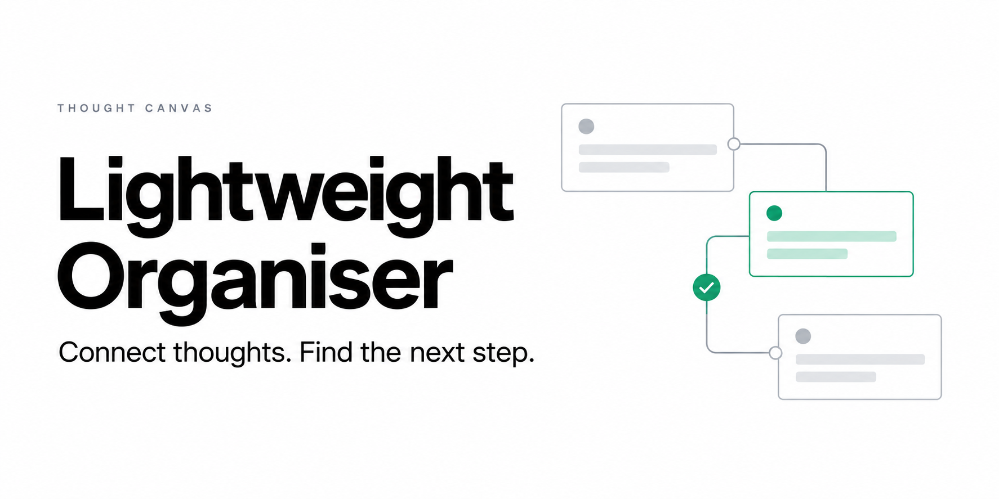

# Lightweight Organiser

**A little space to turn a messy idea into a clear next step.**

Drop tasks onto a canvas, draw connections, break a larger task into subtasks, and generate a working checklist. Lightweight Organiser runs on your own machine and saves the board in your browser. There is no account, cloud database, subscription, or AI service to configure.

## Why use it?

A linear to-do list is useful once you know what needs doing. This canvas is for the moment before that: planning a side project, unpacking an assignment, or getting an overwhelming task out of your head.

- **Arrange first, decide next.** Write short cards and move them into groups.
- **Connect the steps.** Show a parent task and its smaller pieces with arrows.
- **Switch into doing mode.** Generate a checklist and complete related subtasks together.
- **Keep a portable copy.** Export a JSON board, then import it on another browser or machine.
- **Stay local.** Flask serves the interface; board contents stay in browser storage.

This is a deliberately small, single-user desktop-browser tool. It is a good fit for personal planning and a readable starting point for anyone building a visual task interface.

## Run locally

You need **Python 3.10 or newer** and a current desktop browser. Python 3.12 is used for release validation.

```bash
git clone https://github.com/HarshyChoc/LightWeightOrganiser.git
cd LightWeightOrganiser
python3 -m venv .venv
source .venv/bin/activate
python -m pip install -r requirements.txt
python main.py
```

On Windows, use `py -m venv .venv` and `.venv\Scripts\activate` instead of the first two environment commands.

Open **[http://127.0.0.1:5050](http://127.0.0.1:5050)**. Stop the server with `Ctrl+C` in its terminal. It binds to your machine's loopback address; no hosting setup is required.

If port 5050 is occupied, use `PORT=5051 python main.py` on macOS/Linux. In PowerShell, set `$env:PORT = "5051"` before running `python main.py`.

## Make your first plan

1. Click **+ New card**, or double-click an empty part of the canvas. Type a task.
2. Drag a card by its edge to arrange it. Use **Subtask** to turn a card into a smaller step; **Main task** reverses this.
3. Click **Connect** on the parent, then **Connect** on the child. An arrow points from parent to child. `Ctrl`-clicking two cards also works. Press `Escape` to cancel a selection.
4. Click **Generate To-Do List**. Every card appears once, including disconnected cards and cycles. A parent's checkbox also completes its connected subtasks. Native checkboxes support keyboard input.
5. Use **Delete** to remove a card, or right-click a connection to remove that arrow. **Undo** recovers recent board edits.
6. Choose **Export** before moving devices or making a large change. **Import** restores a version 1 JSON board and keeps a local copy of the previous board. Undo can restore a valid board replaced during this session.

Task text is treated as text, including pasted HTML. Standard cut, copy, and paste shortcuts keep their normal behavior.

## Your data and backups

The board is stored under `workflow-board-v1` in your browser's `localStorage`. Earlier versions' `boxes` and `connections` keys are read without rewriting them during startup. An imported board saves the previous state under `workflow-board-backup`.

Browser storage is tied to the exact address. `localhost:5050`, `127.0.0.1:5050`, another port, and another browser all have separate boards. Keep using the same address, or export and import to move your work. Clearing site data, using a private session, or losing a browser profile can remove a board. **Exported JSON files are your backups.**

If saved data cannot be read, the app preserves it and stops autosaving. Export downloads the original stored content for recovery; import a valid backup to resume. If another tab changes the board, this tab pauses saving so it cannot overwrite the newer version. Export your current work before reloading to choose which version to keep. If the browser denies storage or runs out of space, the status line explains that saving failed.

A few intentional limits:

- Undo keeps the last 30 saved edits in memory and resets on reload. It does not replace an exported backup.
- Checklist checkmarks are temporary. Generating a new checklist or reloading resets them; task text, positions, subtask flags, and arrows persist.
- Imports validate card positions, references, and text, with a limit of 1,000 cards, 5,000 connections, and 2 MB per file. The interface is designed for modest personal boards.
- There is no sync, shared editing, login, or server-side board backup. Pointer-based arranging works best on a desktop; this is not a touch-optimised infinite canvas.

## How it works

```text
main.py                 Flask routes and local server
  └─ templates/index.html
       ├─ static/style.css       Canvas, cards, dialogs, and controls
       ├─ static/board-model.js  Validation, legacy reading, and HTML escaping
       └─ static/script.js       Interaction, checklist, import/export, and undo
```

The server renders one page and exposes `/healthz`. All board operations run in vanilla JavaScript. SVG curves connect DOM cards; saving serializes cards and connection indices into one storage value so the two cannot be written out of step. No frontend build step or Node dependency is required to run the app.

## Validate changes

The model tests use Node's built-in test runner; **Node 20+** is needed only for development checks.

```bash
node --check static/script.js
node --test tests/board-model.test.cjs
python -m compileall -q main.py wsgi.py
```

For a local smoke check, create two cards, mark one as a subtask, connect them, edit their text, and reload. Confirm positions, text, and subtask appearance survive. Generate a list and complete the parent, then verify both checkboxes change. Export the board, delete a card, test Undo, and re-import the export. No GitHub Actions or deployment workflow is required.

See [CONTRIBUTING.md](CONTRIBUTING.md) for contribution guidelines.

## License

[MIT](LICENSE) © 2026 Harsh Shah.
